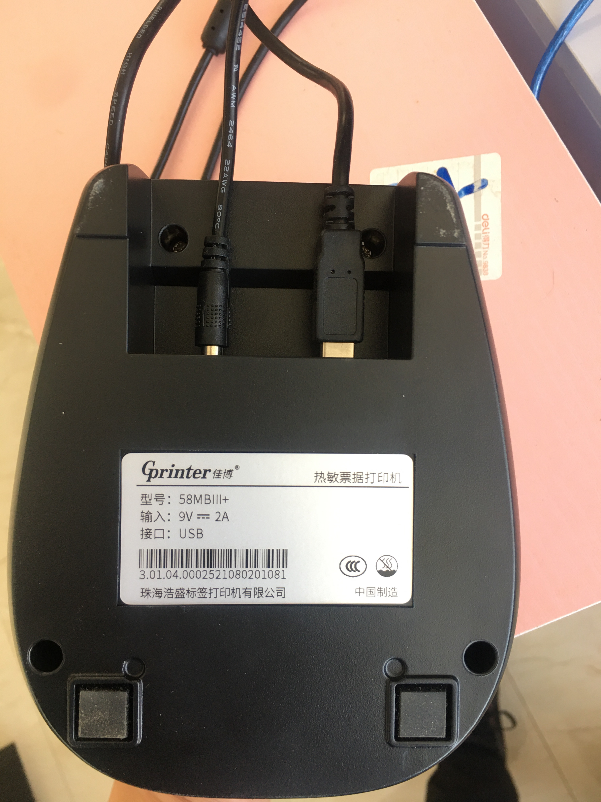

# USB-Printer-Descriptors
收集整理市面上常见的USB打印机描述符。

[TOC]

#### 佳博ZH-380

小票、标签打印机

支持：蓝牙、USB

##### 照片


##### 描述符

```plain
DEVICE ID 6868:0500 on Bus 020 Address 026 =================
 bLength                :   0x12 (18 bytes)
 bDescriptorType        :    0x1 Device
 bcdUSB                 :  0x200 USB 2.0
 bDeviceClass           :    0x0 Specified at interface
 bDeviceSubClass        :    0x0
 bDeviceProtocol        :    0x0
 bMaxPacketSize0        :   0x40 (64 bytes)
 idVendor               : 0x6868
 idProduct              : 0x0500
 bcdDevice              :  0x400 Device 4.0
 iManufacturer          :    0x1 Printer
 iProduct               :    0x2 Printer
 iSerialNumber          :    0x3 6A6958721237
 bNumConfigurations     :    0x1
  CONFIGURATION 1: 100 mA ==================================
   bLength              :    0x9 (9 bytes)
   bDescriptorType      :    0x2 Configuration
   wTotalLength         :   0x20 (32 bytes)
   bNumInterfaces       :    0x1
   bConfigurationValue  :    0x1
   iConfiguration       :    0x0 
   bmAttributes         :   0xc0 Self Powered
   bMaxPower            :   0x32 (100 mA)
    INTERFACE 0: Printer ===================================
     bLength            :    0x9 (9 bytes)
     bDescriptorType    :    0x4 Interface
     bInterfaceNumber   :    0x0
     bAlternateSetting  :    0x0
     bNumEndpoints      :    0x2
     bInterfaceClass    :    0x7 Printer
     bInterfaceSubClass :    0x1
     bInterfaceProtocol :    0x2
     iInterface         :    0x0 
      ENDPOINT 0x84: Bulk IN ===============================
       bLength          :    0x7 (7 bytes)
       bDescriptorType  :    0x5 Endpoint
       bEndpointAddress :   0x84 IN
       bmAttributes     :    0x2 Bulk
       wMaxPacketSize   :   0x40 (64 bytes)
       bInterval        :    0xa
      ENDPOINT 0x3: Bulk OUT ===============================
       bLength          :    0x7 (7 bytes)
       bDescriptorType  :    0x5 Endpoint
       bEndpointAddress :    0x3 OUT
       bmAttributes     :    0x2 Bulk
       wMaxPacketSize   :   0x40 (64 bytes)
       bInterval        :    0xa

```

#### 佳博-58MBIII+

小票、标签打印机

支持：WiFi云打印、USB

##### 照片




##### 描述符

```plain
DEVICE ID 6868:0200 on Bus 020 Address 018 =================
 bLength                :   0x12 (18 bytes)
 bDescriptorType        :    0x1 Device
 bcdUSB                 :  0x200 USB 2.0
 bDeviceClass           :    0x0 Specified at interface
 bDeviceSubClass        :    0x0
 bDeviceProtocol        :    0x0
 bMaxPacketSize0        :   0x40 (64 bytes)
 idVendor               : 0x6868
 idProduct              : 0x0200
 bcdDevice              :  0x100 Device 1.0
 iManufacturer          :    0x1 GPrinter
 iProduct               :    0x2 GP-58
 iSerialNumber          :    0x0 
 bNumConfigurations     :    0x1
  CONFIGURATION 1: 100 mA ==================================
   bLength              :    0x9 (9 bytes)
   bDescriptorType      :    0x2 Configuration
   wTotalLength         :   0x20 (32 bytes)
   bNumInterfaces       :    0x1
   bConfigurationValue  :    0x1
   iConfiguration       :    0x0 
   bmAttributes         :   0xa0 Bus Powered, Remote Wakeup
   bMaxPower            :   0x32 (100 mA)
    INTERFACE 0: Printer ===================================
     bLength            :    0x9 (9 bytes)
     bDescriptorType    :    0x4 Interface
     bInterfaceNumber   :    0x0
     bAlternateSetting  :    0x0
     bNumEndpoints      :    0x2
     bInterfaceClass    :    0x7 Printer
     bInterfaceSubClass :    0x1
     bInterfaceProtocol :    0x2
     iInterface         :    0x0 
      ENDPOINT 0x81: Bulk IN ===============================
       bLength          :    0x7 (7 bytes)
       bDescriptorType  :    0x5 Endpoint
       bEndpointAddress :   0x81 IN
       bmAttributes     :    0x2 Bulk
       wMaxPacketSize   :   0x40 (64 bytes)
       bInterval        :    0x0
      ENDPOINT 0x2: Bulk OUT ===============================
       bLength          :    0x7 (7 bytes)
       bDescriptorType  :    0x5 Endpoint
       bEndpointAddress :    0x2 OUT
       bmAttributes     :    0x2 Bulk
       wMaxPacketSize   :   0x40 (64 bytes)
       bInterval        :    0x0
```


#### 佳博GP-R222C

小票打印机

支持：WiFi云打印、USB

##### 照片


##### 描述符

```plain
DEVICE ID 6868:0500 on Bus 020 Address 027 =================
 bLength                :   0x12 (18 bytes)
 bDescriptorType        :    0x1 Device
 bcdUSB                 :  0x200 USB 2.0
 bDeviceClass           :    0x2 Communications Device
 bDeviceSubClass        :    0x0
 bDeviceProtocol        :    0x0
 bMaxPacketSize0        :   0x40 (64 bytes)
 idVendor               : 0x6868
 idProduct              : 0x0500
 bcdDevice              :  0x100 Device 1.0
 iManufacturer          :    0x1 Zhuhai Howbest Label Printer Co.,Ltd.
 iProduct               :    0x2 Gprinter USB Printer
 iSerialNumber          :    0x3 0002A0000000
 bNumConfigurations     :    0x1
  CONFIGURATION 1: 100 mA ==================================
   bLength              :    0x9 (9 bytes)
   bDescriptorType      :    0x2 Configuration
   wTotalLength         :   0x20 (32 bytes)
   bNumInterfaces       :    0x1
   bConfigurationValue  :    0x1
   iConfiguration       :    0x0 
   bmAttributes         :   0x80 Bus Powered
   bMaxPower            :   0x32 (100 mA)
    INTERFACE 0: Printer ===================================
     bLength            :    0x9 (9 bytes)
     bDescriptorType    :    0x4 Interface
     bInterfaceNumber   :    0x0
     bAlternateSetting  :    0x0
     bNumEndpoints      :    0x2
     bInterfaceClass    :    0x7 Printer
     bInterfaceSubClass :    0x1
     bInterfaceProtocol :    0x2
     iInterface         :    0x0 
      ENDPOINT 0x81: Bulk IN ===============================
       bLength          :    0x7 (7 bytes)
       bDescriptorType  :    0x5 Endpoint
       bEndpointAddress :   0x81 IN
       bmAttributes     :    0x2 Bulk
       wMaxPacketSize   :   0x40 (64 bytes)
       bInterval        :    0x0
      ENDPOINT 0x1: Bulk OUT ===============================
       bLength          :    0x7 (7 bytes)
       bDescriptorType  :    0x5 Endpoint
       bEndpointAddress :    0x1 OUT
       bmAttributes     :    0x2 Bulk
       wMaxPacketSize   :   0x40 (64 bytes)
       bInterval        :    0x0
```

#### 芯烨-XP-T58H

小票打印机

支持：WiFi云打印、USB

##### 照片


##### 描述符

```plain
DEVICE ID 0483:5743 on Bus 020 Address 019 =================
 bLength                :   0x12 (18 bytes)
 bDescriptorType        :    0x1 Device
 bcdUSB                 :  0x200 USB 2.0
 bDeviceClass           :    0x0 Specified at interface
 bDeviceSubClass        :    0x0
 bDeviceProtocol        :    0x0
 bMaxPacketSize0        :   0x40 (64 bytes)
 idVendor               : 0x0483
 idProduct              : 0x5743
 bcdDevice              :  0x200 Device 2.0
 iManufacturer          :    0x1 Xprinter 
 iProduct               :    0x2 USB Printer P
 iSerialNumber          :    0x3 00000000051C
 bNumConfigurations     :    0x1
  CONFIGURATION 1: 32 mA ===================================
   bLength              :    0x9 (9 bytes)
   bDescriptorType      :    0x2 Configuration
   wTotalLength         :   0x20 (32 bytes)
   bNumInterfaces       :    0x1
   bConfigurationValue  :    0x1
   iConfiguration       :    0x0 
   bmAttributes         :   0xc0 Self Powered
   bMaxPower            :   0x10 (32 mA)
    INTERFACE 0: Printer ===================================
     bLength            :    0x9 (9 bytes)
     bDescriptorType    :    0x4 Interface
     bInterfaceNumber   :    0x0
     bAlternateSetting  :    0x0
     bNumEndpoints      :    0x2
     bInterfaceClass    :    0x7 Printer
     bInterfaceSubClass :    0x1
     bInterfaceProtocol :    0x2
     iInterface         :    0x0 
      ENDPOINT 0x2: Bulk OUT ===============================
       bLength          :    0x7 (7 bytes)
       bDescriptorType  :    0x5 Endpoint
       bEndpointAddress :    0x2 OUT
       bmAttributes     :    0x2 Bulk
       wMaxPacketSize   :   0x40 (64 bytes)
       bInterval        :    0x0
      ENDPOINT 0x81: Bulk IN ===============================
       bLength          :    0x7 (7 bytes)
       bDescriptorType  :    0x5 Endpoint
       bEndpointAddress :   0x81 IN
       bmAttributes     :    0x2 Bulk
       wMaxPacketSize   :   0x40 (64 bytes)
       bInterval        :    0x0

```


#### 德佟-DP30S

标签打印机

支持：便携电源、蓝牙、USB

说明：无法通过USB写操作进行打印，端口0x01无反应，短信0x02失败

##### 照片


##### 描述符

```plain
DEVICE ID 0483:5a19 on Bus 020 Address 027 =================
 bLength                :   0x12 (18 bytes)
 bDescriptorType        :    0x1 Device
 bcdUSB                 :  0x200 USB 2.0
 bDeviceClass           :   0xef Miscellaneous
 bDeviceSubClass        :    0x2
 bDeviceProtocol        :    0x1
 bMaxPacketSize0        :   0x40 (64 bytes)
 idVendor               : 0x0483
 idProduct              : 0x5a19
 bcdDevice              : 0x30c4 Device 48.124
 iManufacturer          :    0x1 DeTong
 iProduct               :    0x2 DP30 Label Printer
 iSerialNumber          :    0x3 048353482034
 bNumConfigurations     :    0x1
  CONFIGURATION 1: 0 mA ====================================
   bLength              :    0x9 (9 bytes)
   bDescriptorType      :    0x2 Configuration
   wTotalLength         :   0x40 (64 bytes)
   bNumInterfaces       :    0x2
   bConfigurationValue  :    0x1
   iConfiguration       :    0x2 DP30 Label Printer
   bmAttributes         :   0xc0 Self Powered
   bMaxPower            :    0x0 (0 mA)
    INTERFACE 0: Printer ===================================
     bLength            :    0x9 (9 bytes)
     bDescriptorType    :    0x4 Interface
     bInterfaceNumber   :    0x0
     bAlternateSetting  :    0x0
     bNumEndpoints      :    0x2
     bInterfaceClass    :    0x7 Printer
     bInterfaceSubClass :    0x1
     bInterfaceProtocol :    0x1
     iInterface         :   0x13 DeTong DP30 Label Printer HID Port
      ENDPOINT 0x81: Bulk IN ===============================
       bLength          :    0x7 (7 bytes)
       bDescriptorType  :    0x5 Endpoint
       bEndpointAddress :   0x81 IN
       bmAttributes     :    0x2 Bulk
       wMaxPacketSize   :   0x40 (64 bytes)
       bInterval        :    0x0
      ENDPOINT 0x1: Bulk OUT ===============================
       bLength          :    0x7 (7 bytes)
       bDescriptorType  :    0x5 Endpoint
       bEndpointAddress :    0x1 OUT
       bmAttributes     :    0x2 Bulk
       wMaxPacketSize   :   0x40 (64 bytes)
       bInterval        :    0x0
    INTERFACE 1: Human Interface Device ====================
     bLength            :    0x9 (9 bytes)
     bDescriptorType    :    0x4 Interface
     bInterfaceNumber   :    0x1
     bAlternateSetting  :    0x0
     bNumEndpoints      :    0x2
     bInterfaceClass    :    0x3 Human Interface Device
     bInterfaceSubClass :    0x0
     bInterfaceProtocol :    0x0
     iInterface         :   0x12 DeTong DothanTech DP30 Label Printer
      ENDPOINT 0x82: Interrupt IN ==========================
       bLength          :    0x7 (7 bytes)
       bDescriptorType  :    0x5 Endpoint
       bEndpointAddress :   0x82 IN
       bmAttributes     :    0x3 Interrupt
       wMaxPacketSize   :   0x40 (64 bytes)
       bInterval        :    0x1
      ENDPOINT 0x2: Interrupt OUT ==========================
       bLength          :    0x7 (7 bytes)
       bDescriptorType  :    0x5 Endpoint
       bEndpointAddress :    0x2 OUT
       bmAttributes     :    0x3 Interrupt
       wMaxPacketSize   :   0x40 (64 bytes)
       bInterval        :    0x1
```


#### 芯烨-XP-P323B

标签打印机

支持：便携电源、蓝牙、USB


##### 照片


##### 描述符

```plain
DEVICE ID 2d37:cbb4 on Bus 020 Address 029 =================
 bLength                :   0x12 (18 bytes)
 bDescriptorType        :    0x1 Device
 bcdUSB                 :  0x200 USB 2.0
 bDeviceClass           :    0x0 Specified at interface
 bDeviceSubClass        :    0x0
 bDeviceProtocol        :    0x0
 bMaxPacketSize0        :   0x40 (64 bytes)
 idVendor               : 0x2d37
 idProduct              : 0xcbb4
 bcdDevice              :  0x100 Device 1.0
 iManufacturer          :    0x0 
 iProduct               :    0x0 
 iSerialNumber          :    0x1 P323BG21C040079
 bNumConfigurations     :    0x1
  CONFIGURATION 1: 0 mA ====================================
   bLength              :    0x9 (9 bytes)
   bDescriptorType      :    0x2 Configuration
   wTotalLength         :   0x20 (32 bytes)
   bNumInterfaces       :    0x1
   bConfigurationValue  :    0x1
   iConfiguration       :    0x0 
   bmAttributes         :   0xc0 Self Powered
   bMaxPower            :    0x0 (0 mA)
    INTERFACE 0: Printer ===================================
     bLength            :    0x9 (9 bytes)
     bDescriptorType    :    0x4 Interface
     bInterfaceNumber   :    0x0
     bAlternateSetting  :    0x0
     bNumEndpoints      :    0x2
     bInterfaceClass    :    0x7 Printer
     bInterfaceSubClass :    0x1
     bInterfaceProtocol :    0x2
     iInterface         :    0x0 
      ENDPOINT 0x1: Bulk OUT ===============================
       bLength          :    0x7 (7 bytes)
       bDescriptorType  :    0x5 Endpoint
       bEndpointAddress :    0x1 OUT
       bmAttributes     :    0x2 Bulk
       wMaxPacketSize   :   0x40 (64 bytes)
       bInterval        :    0x0
      ENDPOINT 0x82: Bulk IN ===============================
       bLength          :    0x7 (7 bytes)
       bDescriptorType  :    0x5 Endpoint
       bEndpointAddress :   0x82 IN
       bmAttributes     :    0x2 Bulk
       wMaxPacketSize   :   0x40 (64 bytes)
       bInterval        :    0x0
```


------


#### 汉印-HM-A300S

标签打印机

支持：便携电源、蓝牙、USB

说明：通过USB0x01端口输出数据时原样输出（TSPL、CPCL均一样）

##### 照片


##### 描述符

```plain
DEVICE ID 20d1:7007 on Bus 020 Address 031 =================
 bLength                :   0x12 (18 bytes)
 bDescriptorType        :    0x1 Device
 bcdUSB                 :  0x200 USB 2.0
 bDeviceClass           :    0x2 Communications Device
 bDeviceSubClass        :    0x0
 bDeviceProtocol        :    0x0
 bMaxPacketSize0        :   0x40 (64 bytes)
 idVendor               : 0x20d1
 idProduct              : 0x7007
 bcdDevice              :  0x101 Device 1.01
 iManufacturer          :    0x1 NXP SEMICONDUCTORS
 iProduct               :    0x2 <0x00>x16
 iSerialNumber          :    0x3 MA300S21300261XX
 bNumConfigurations     :    0x1
  CONFIGURATION 1: 100 mA ==================================
   bLength              :    0x9 (9 bytes)
   bDescriptorType      :    0x2 Configuration
   wTotalLength         :   0x20 (32 bytes)
   bNumInterfaces       :    0x1
   bConfigurationValue  :    0x1
   iConfiguration       :    0x0 
   bmAttributes         :   0xc0 Self Powered
   bMaxPower            :   0x32 (100 mA)
    INTERFACE 0: Printer ===================================
     bLength            :    0x9 (9 bytes)
     bDescriptorType    :    0x4 Interface
     bInterfaceNumber   :    0x0
     bAlternateSetting  :    0x0
     bNumEndpoints      :    0x2
     bInterfaceClass    :    0x7 Printer
     bInterfaceSubClass :    0x1
     bInterfaceProtocol :    0x2
     iInterface         :    0x0 
      ENDPOINT 0x1: Bulk OUT ===============================
       bLength          :    0x7 (7 bytes)
       bDescriptorType  :    0x5 Endpoint
       bEndpointAddress :    0x1 OUT
       bmAttributes     :    0x2 Bulk
       wMaxPacketSize   :  0x200 (512 bytes)
       bInterval        :    0x6
      ENDPOINT 0x82: Bulk IN ===============================
       bLength          :    0x7 (7 bytes)
       bDescriptorType  :    0x5 Endpoint
       bEndpointAddress :   0x82 IN
       bmAttributes     :    0x2 Bulk
       wMaxPacketSize   :   0x40 (64 bytes)
       bInterval        :    0x6
```
